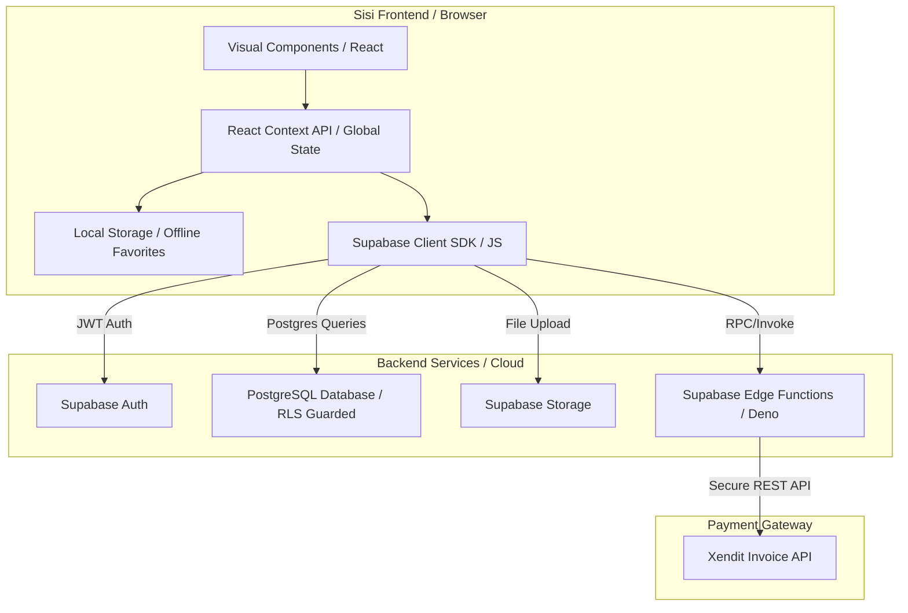

# Arsitektur Proyek (Project Architecture) — Supabase Serverless
## Nama Proyek: RideVault (Platform Sewa Motor Premium)

RideVault menggunakan arsitektur **Serverless Single Page Application (SPA)**. Sisi frontend (React, Vite, Tailwind CSS) berinteraksi secara langsung dengan layanan cloud **Supabase** (Database PostgreSQL, Realtime, Storage, dan Edge Functions) secara aman tanpa melalui server backend tradisional (backend-less).

---

## 1. Aliran Komunikasi Client-Server

---

## 2. Aliran Data Utama (Key Data Flows)

### 2.1. Aliran Autentikasi & Profil Pengguna
1. **Pendaftaran/Masuk**: Pengguna melakukan otentikasi melalui email/password atau Google OAuth (SSO) menggunakan Supabase Auth.
2. **Postgres Profile Mapping**: Setelah otentikasi berhasil, `AuthContext` mendeteksi sesi aktif dan memuat profil pengguna dari tabel `public.users` di database.
3. **Auto-Seeding Profil**: Jika pengguna baru masuk untuk pertama kalinya, sistem secara otomatis membuat baris profil baru dengan tingkatan membership `default` dan memberi mereka poin loyalitas sambutan serta voucher diskon (dijalankan via trigger PostgreSQL `trg_welcome_bonus` di database).
4. **Real-time Synchronization**: Frontend berlangganan (*subscribe*) perubahan data baris user di PostgreSQL melalui channel Supabase Realtime. Setiap kali poin loyalitas, tier, atau status diubah oleh sistem atau admin, frontend langsung memperbarui tampilannya tanpa perlu memuat ulang halaman (*refresh*).

### 2.2. Pembuatan Invoice & Pembayaran Xendit (Aman)
1. **Submit Reservasi**: Setelah mengisi data di multi-step wizard, penyewa menekan tombol "Konfirmasi Reservasi".
2. **Postgres Booking Log**: Frontend menulis reservasi baru ke tabel `public.bookings` dengan status `Pending` dan status pembayaran `pending`.
3. **Invoke Edge Function**: Frontend memanggil Supabase Edge Function `create-xendit-invoice` dengan payload data transaksi.
4. **Server-Side API Call**: Supabase Edge Function (berjalan di runtime Deno terisolasi) mengambil `XENDIT_SECRET_KEY` dari environment variables yang aman di cloud, lalu menembak REST API Xendit untuk membuat invoice digital.
5. **Redirect ke Xendit**: Edge Function mengembalikan URL invoice ke browser. Frontend kemudian mengarahkan pengguna ke halaman pembayaran Xendit.
6. **Pembayaran Sukses**: Setelah melakukan pembayaran, Xendit mengarahkan pengguna kembali ke halaman konfirmasi RideVault dengan status `success`. Halaman konfirmasi kemudian memperbarui status booking menjadi `Confirmed` dan status bayar menjadi `paid` melalui Supabase.

---

## 3. Isolasi Keamanan & Akses (Security Isolation)

### 3.1. Keamanan Akses Rute Frontend
* Hak akses ke halaman administrator `/admin` dilindungi di tingkat klien oleh pembatas rute `<AdminRoute>` di [src/components/AdminRoute.tsx](file:///c:/_Collage/Rozin/SMT04/IMK/ridevault/src/components/AdminRoute.tsx). Rute ini memverifikasi bahwa `userProfile` aktif memiliki properti `role === 'admin'`. Jika tidak, pengguna langsung dilempar ke `/login`.

### 3.2. Row Level Security (RLS) di Database
Sebagai pertahanan utama (*defense in depth*), data di PostgreSQL dilindungi oleh kebijakan RLS (Row Level Security):
* **Tabel Users**: Pengguna biasa tidak memiliki izin untuk membaca data profil milik pengguna lain. Hanya baris data miliknya sendiri yang dapat dibaca/diperbarui (`auth.uid() = id`).
* **Fungsi `public.is_admin`**: Database mendefinisikan fungsi keamanan `is_admin(auth.uid())` untuk memeriksa peran pengguna secara dinamis dan memberikan otorisasi penuh kepada Admin untuk membaca/menulis data seluruh tabel secara aman di sisi server.
