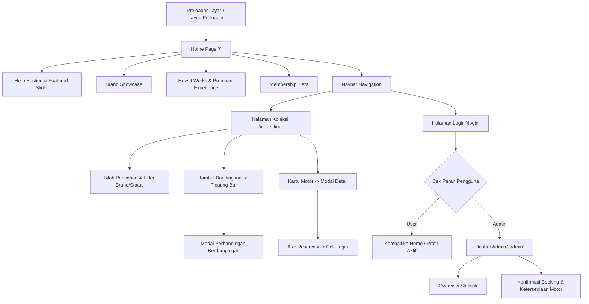

# Panduan Alur UI/UX (UI/UX Flow Document)
## Nama Proyek: RideVault (Platform Sewa Motor Premium)
**Versi:** 1.0  
**Penulis:** Rozin - vibecoding & Antigravity AI  

---

## 1. Peta Situs & Arsitektur Informasi (Sitemap)

Berikut adalah struktur navigasi dan halaman utama dalam aplikasi RideVault yang digambarkan menggunakan diagram alir:

---

## 2. Palet Warna & Panduan Desain Visual (Design System)

Untuk menghadirkan kesan mewah, eksotis, dan berkinerja tinggi, RideVault menggunakan panduan visual berikut:

| Elemen UI | Nilai Warna (HEX/HSL) | Deskripsi / Penggunaan |
| :--- | :--- | :--- |
| **Latar Belakang Utama** | `#050505` (Pitch Black) | Memberikan kesan misterius dan menyorot gambar motor. |
| **Latar Belakang Halaman** | `#FAFAFA` (Off-White) | Digunakan pada Halaman Koleksi untuk kenyamanan membaca spesifikasi. |
| **Warna Aksen Premium** | `#D4AF37` (Metallic Gold) | Digunakan untuk branding, tombol CTA utama, teks highlight, dan status eksklusif. |
| **Warna Teks Utama** | `#F3F4F6` (Cool Gray) | Untuk keterbacaan teks maksimal pada latar gelap. |
| **Efek Glassmorphism** | `rgba(13, 13, 13, 0.8)` | Latar belakang dropdown dan modal dengan efek blur filter blur-xl. |

---

## 3. Detail Alur Pengguna (User Flows)

### 3.1. Alur 1: Penelusuran & Sistem Favorit (Tanpa Login)
Alur ini dirancang sangat mulus tanpa menghalangi calon penyewa dengan form registrasi di awal.
1. **Titik Masuk (Entry Point):** Pengguna masuk ke `Home` `/` atau `Koleksi` `/collection`.
2. **Interaksi Kartu Motor:** Pengguna melihat daftar motor yang disajikan dalam grid responsif.
3. **Klik Tombol Favorit (Ikon Hati):**
   * Pengguna mengklik ikon hati di kartu motor.
   * Sistem mendeteksi klik -> Menyimpan ID Motor ke `localStorage` (`favoriteBikes`).
   * Mengubah status visual tombol menjadi merah cerah.
   * Navbar mendapatkan notifikasi perubahan dan memicu toast pesan: *"Garasi Favorit: Daftar superbike pilihan Anda tersimpan dengan aman."*
4. **Persistensi:** Saat pengguna menutup browser dan kembali ke situs di kemudian hari, daftar motor favorit tetap ada di antarmuka.

### 3.2. Alur 2: Perbandingan Motor Berdampingan (Side-by-Side)
Fitur interaktif untuk membantu pengguna membandingkan dua motor sport dengan spesifikasi ekstrem.
1. Pengguna berada di halaman `/collection`.
2. Pengguna mengklik tombol **"Bandingkan"** pada motor A.
3. **Floating Compare Bar** muncul dari bawah layar secara instan dengan efek slide-up, menampilkan status: `Bandingkan (1/2)`.
4. Pengguna memilih motor B dengan mengklik **"Bandingkan"** pada motor kedua.
5. Floating bar memperbarui statusnya menjadi: `Lihat Perbandingan (2/2)` (Tombol berubah menjadi aktif berwarna emas).
6. Pengguna mengklik tombol tersebut.
7. **Modal Perbandingan Berdampingan** terbuka di tengah layar secara layar penuh:
   * Menampilkan spesifikasi utama (Engine, Power, Torque, Weight, Top Speed, Price/Day) dalam format tabel komparasi dua kolom.
   * Pengguna dapat menekan tombol silang `X` untuk menutup modal dan kembali ke halaman koleksi.

### 3.3. Alur 3: Reservasi Unit (Membutuhkan Autentikasi)
Alur transaksional yang mengamankan reservasi sepeda motor ke Firebase.
1. Pengguna membuka modal detail motor (melalui tombol "Detail" atau klik kartu motor).
2. Pengguna mengklik tombol **"Pesan Sekarang" (Reserve)**.
3. **Cek Autentikasi:**
   * **Jika Belum Login:** Sistem mendeteksi status auth kosong -> Mengarahkan pengguna secara otomatis ke halaman `/login` dengan visual transisi halus, menampilkan status *"Otorisasi Diperlukan"*.
   * **Jika Sudah Login:** Mengaktifkan form popup pemilihan tanggal sewa (*Start Date* & *End Date*).
4. Pengguna memilih tanggal -> Sistem menghitung otomatis total tarif berdasarkan jumlah hari dikali tarif sewa harian.
5. Pengguna mengklik **"Konfirmasi Reservasi"**:
   * Sistem membuat dokumen transaksi baru di Firestore pada koleksi `/bookings`.
   * Sistem memicu notifikasi toast concierge sukses: *"Sewa Berhasil Dipesan!"*.
   * Status ketersediaan motor diperbarui secara otomatis menjadi `Reserved` (jika disetujui admin).

### 3.4. Alur 4: Pendaftaran Keanggotaan (Membership Upgrade)
Bagian eksklusif untuk meningkatkan tier pengguna guna mendapatkan potongan harga dan layanan VIP.
1. Pengguna menavigasi ke bagian **Membership** di halaman utama (`/#membership`).
2. Pengguna melihat tabel perbandingan manfaat (Bronze, Silver, Gold, Elite).
3. Pengguna memilih salah satu tingkat keanggotaan dan mengklik **"Pilih"** (Choose Plan).
4. **Proses Upgrade:**
   * Sistem memicu pembaruan bidang `tier` pada dokumen profil pengguna di Firestore `/users/{userId}`.
   * Halaman secara dinamis memicu micro-animation kartu keanggotaan baru.
   * Navbar memperbarui warna lencana avatar dan latar belakang dropdown menu profil secara instan (mengikuti warna tier baru, misal emas untuk Elite).

### 3.5. Alur 5: Manajemen Status oleh Administrator
Alur operasional di mana administrator mengontrol ketersediaan armada dan transaksi.
1. Admin masuk melalui halaman `/login` menggunakan akun bereselon Admin.
2. Sistem mendeteksi `role: 'admin'` -> Mengarahkan secara otomatis ke dasbor `/admin`.
3. **Panel Admin:**
   * Admin melihat grafik ringkasan keuangan dan jumlah sewa aktif.
   * Di tab **Reservasi**, admin dapat melihat daftar transaksi sewa yang diajukan oleh pengguna dengan status `Pending`.
   * Admin dapat menyetujui transaksi (mengubah status menjadi `Confirmed`/`Completed`) atau menolaknya (`Cancelled`).
   * Perubahan status ini langsung memperbarui status motor di basis data Firestore, sehingga pengguna lain dapat melihat motor tersebut kembali tersedia atau dipesan secara langsung.

---

## 4. Efek Transisi & Animasi (Framer Motion)

Untuk mendukung estetika premium, seluruh elemen dinamis menggunakan konfigurasi transisi dari `motion/react`:

* **Preloader Halaman Utama (LayoutPreloader):**
  * Animasi tirai gelap yang memudar (*fade-out* & *scale-up*) selama 1 detik setelah seluruh dependensi dimuat.
* **Transisi Rute Halaman (Page Transitions):**
  * Transisi geser horizontal halus (*slide & fade*) saat berpindah dari halaman Beranda `/` ke Halaman Koleksi `/collection`.
* **Interaksi Modal (Detail & Perbandingan):**
  * Efek *spring transition* (`type: "spring", stiffness: 300, damping: 30`) untuk pop-up modal, memberikan nuansa antarmuka yang sangat responsif, organik, dan elegan.
* **Scroll-to-Top Button:**
  * Tombol melayang di pojok kanan bawah yang hanya muncul ketika pengguna menggulir halaman ke bawah melebihi 300px, didukung dengan animasi *scale-in* dan *scale-out*.
